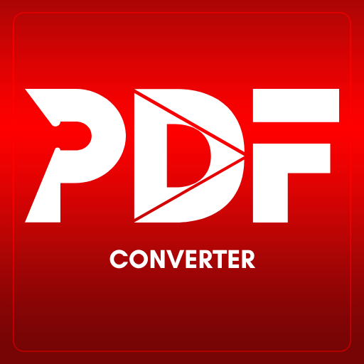
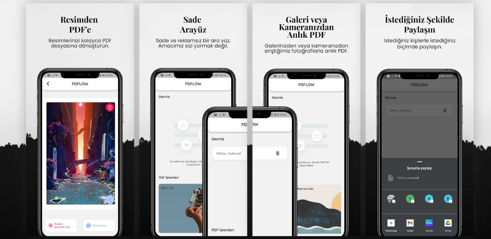

 

  

  <h3 align="center">PDFlow</h3>

  

    An Awesome PDF converter tool.
     
     
    <a href="https://github.com/mhmetglrq/PDFlow"><strong>Explore the docs »</strong></a>
     
     
    <a href="https://play.google.com/store/apps/details?id=com.nevereverstudio.pdflow">View app on Play Store</a>
    .
    <a href="https://github.com/mhmetglrq/PDFlow/issues">Report Bug</a>
    .
    <a href="https://github.com/mhmetglrq/PDFlow/issues">Request Feature</a>
  

  <h3 align="center">[(images/google-play-store.png](https://play.google.com/store/apps/details?id=com.nevereverstudio.pdflow)</h3>

   

## About The Project

Although many PDF converters are used, why not a converter that I developed myself and that I can add the features I want?

Here is PDFlow!

A converter with which you can easily convert any type of image to PDF files. Here are the reasons why you should check out this repository:

● Developed with Dart/Flutter 
● Developed with Riverpod 2 in MVC architecture 
● A simple, understandable project on which you can add the features you want 
● A good example of using multiple spoken languages 

I hope this repository meets a few things you need.

## Built With

Developed with Dart/Flutter💙. A good example of developing with Riverpod, which is suitable for MVC architecture.

* [Flutter](https://flutter.dev/)
* [Dart](https://dart.dev/)
* [PDF package](https://pub.dev/packages/pdf)
* [Riverpod ](https://riverpod.dev/)

## Getting Started

This is an example of how you may give instructions on setting up your project locally.
To get a local copy up and running follow these simple example steps.

### Installation

● As a first step, clone the project by selecting the desired directory  
       <t/>» git clone https://github.com/mhmetglrq/PDFlow.git  
● After opening the project, run the following command in your terminal  
       <t/>» flutter pub get  
● Your project is ready to work 🙌  

## Authors

* **[Mehmet Güler](https://github.com/mhmetglrq/)** - *Software Developer* 

